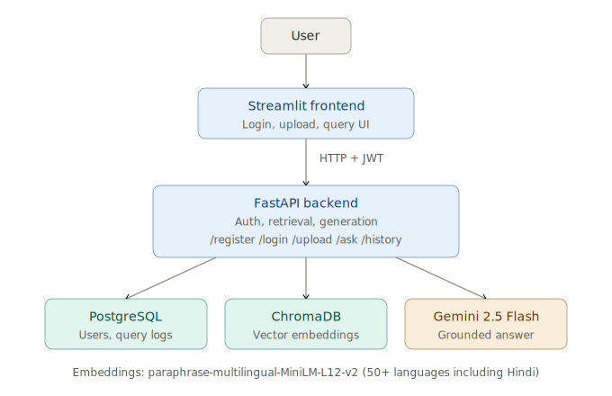
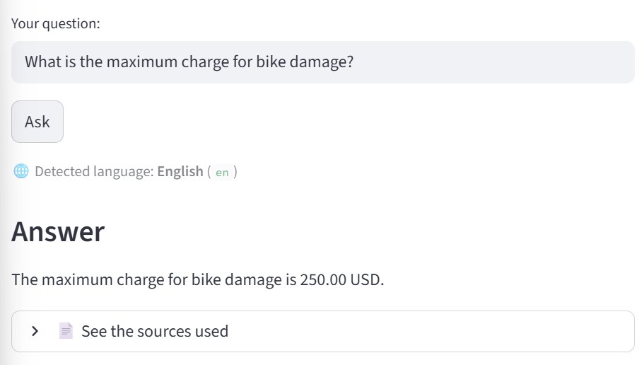
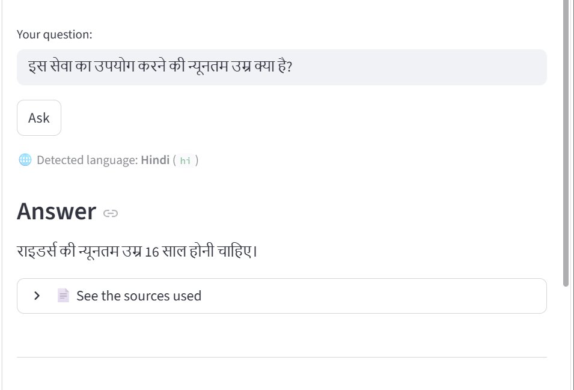

# Multilingual RAG Assistant

A production-grade Retrieval-Augmented Generation pipeline that answers questions about uploaded PDF documents, with grounded answers, cited sources, and a measurable evaluation harness.

Built as a multi-service application: containerized FastAPI backend, decoupled Streamlit frontend, persistent ChromaDB vector store, PostgreSQL for users and query telemetry, and JWT authentication.

**Repository:** https://github.com/asritha660/multilingual-rag

## What this project demonstrates

- **Cross-lingual retrieval** with shared-embedding-space queries, tested end-to-end on English and Hindi. The underlying embedding model supports 50+ languages, but retrieval quality varies across languages (see [REPORT.md](REPORT.md) for measured cross-lingual notes).
- **Hybrid retrieval**: dense vector search plus BM25 keyword search, fused and deduplicated.
- **Conditional reranking**: a cross-encoder reranker is applied to English queries (the model is English-only) and skipped for other languages, which then use a wider hybrid top-K.
- **Grounded generation**: answers are produced strictly from retrieved chunks, returned in the same language as the question, with a sources panel for verification.
- **Measured behavior**: a versioned test set, automated retrieval and faithfulness evaluation scripts, and PostgreSQL-captured latency telemetry on every query.

## Measured Results

Evaluated on a 7-question test set (6 English plus 1 Hindi) over a fully fabricated test corpus (`test_document.pdf`). The set includes a deliberate keyword-dilution stress-test question.

| Metric | Value |
|---|---|
| Hit Rate (recall proxy) | **7/7 = 1.00** |
| Average Precision@K | **0.35** |
| Average retrieval latency | **0.17s** |
| Faithfulness score | **6/6 = 1.00** (LLM-judge, Gemini 2.5 Flash) |
| Hallucination rate | **0.00** |
| End-to-end query latency | **~2.9s** (generation dominates) |

The system achieves saturated recall and perfect faithfulness on this test set; the genuine remaining weakness is precision, not recall. Detailed analysis lives in [REPORT.md](REPORT.md).

## Architecture



The FastAPI backend is containerized (Python 3.11-slim, 622 MB compressed image). It runs locally with Docker Desktop and is portable to any host with at least 1 GB of RAM. See [REPORT.md](REPORT.md) for the deployment analysis explaining why free-tier hosts are not sufficient for this image.

## Tech Stack

| Layer | Choice |
|---|---|
| Backend API | FastAPI |
| Frontend | Streamlit |
| Authentication | JWT (`python-jose`) with bcrypt password hashing |
| Embeddings | `sentence-transformers`, `paraphrase-multilingual-MiniLM-L12-v2` |
| Reranker | `cross-encoder/ms-marco-MiniLM-L-6-v2` (English-only, conditional) |
| Vector DB | ChromaDB (persistent local store) |
| Keyword Search | BM25 via `rank-bm25` |
| Generation | Google Gemini 2.5 Flash (via `google-genai`) |
| Relational DB | PostgreSQL (users, documents, query_logs) — runs locally or on hosted services like Neon |
| Language Detection | `langdetect` (seeded for determinism) |
| PDF Parsing | `pypdf` |
| Chunking | `langchain-text-splitters` RecursiveCharacterTextSplitter |
| Container | Docker (Python 3.11-slim) |
| Runtime | Python 3.11 |

## Project Structure

```
multilingual-rag/
├── backend/                  FastAPI app, retrieval, ingestion, auth, DB
│   ├── main.py               API endpoints (/register, /login, /upload, /ask, /history)
│   ├── ingest.py             PDF ingestion CLI + importable function
│   ├── database.py           PostgreSQL connection and helper functions
│   └── auth.py               JWT issuance and verification
├── frontend/
│   └── app.py                Streamlit UI calling the backend over HTTP
├── evaluation/
│   ├── test_set.json         Versioned test questions and expected keywords
│   ├── evaluate_retrieval.py Hit Rate, Precision@K, latency (no LLM calls)
│   └── evaluate_faithfulness.py Gemini-as-judge faithfulness scoring
├── architecture.svg          Architecture diagram (also as PNG)
├── Dockerfile                Backend container (python:3.11-slim, port 8000)
├── init_schema.sql           PostgreSQL schema (users, documents, query_logs)
├── requirements.txt
├── test_document.pdf         Fictional test corpus for reproducible evaluation
├── REPORT.md                 Evaluation methodology, numbers, analysis
└── README.md                 (this file)
```

## Setup

### Prerequisites

- Python 3.11
- PostgreSQL 14+ running locally, OR a hosted Postgres URL (Neon, Supabase, etc.)
- A Gemini API key from https://aistudio.google.com/apikey (free tier works)
- Docker Desktop (optional, only for the containerized path)

### Local development (no Docker)

```powershell
git clone https://github.com/asritha660/multilingual-rag.git
cd multilingual-rag
python -m venv venv
.\venv\Scripts\Activate.ps1
pip install -r requirements.txt
```

Create a `.env` file in the project root:

```
GEMINI_API_KEY=your_key_here
JWT_SECRET_KEY=any_long_random_string
DB_NAME=ragdb
DB_USER=postgres
DB_PASSWORD=your_postgres_password
DB_HOST=localhost
DB_PORT=5432
```

(For hosted Postgres, set `DB_HOST` to the hosted hostname, set `DB_USER` and `DB_PASSWORD` to the hosted credentials, set `DB_NAME` to the hosted database name, and add `DB_SSLMODE=require`.)

Create the schema (one-time):

```powershell
# Connect to your Postgres with psql, then run:
\i init_schema.sql
```

Or run the schema from Python:

```powershell
python -c "from backend.database import get_connection; conn=get_connection(); cur=conn.cursor(); cur.execute(open('init_schema.sql').read()); conn.commit(); conn.close(); print('Schema created')"
```

Ingest the bundled test document:

```powershell
python backend\ingest.py test_document.pdf
```

Run the backend:

```powershell
python -m uvicorn backend.main:app --reload --port 8000
```

In a second terminal, run the frontend:

```powershell
python -m streamlit run frontend\app.py
```

The app opens at `http://localhost:8501`. The backend is at `http://localhost:8000`.

### Containerized backend (Docker)

```powershell
docker build -t multilingual-rag-backend .
docker run -d --name rag-backend -p 8000:8000 -e DB_HOST=host.docker.internal multilingual-rag-backend
```

The backend will be reachable at `http://localhost:8000` and will connect to PostgreSQL on the host machine via `host.docker.internal`.

Stop and remove:

```powershell
docker stop rag-backend
docker rm rag-backend
```

### Running the evaluation harness

After ingesting `test_document.pdf`:

```powershell
python -m evaluation.evaluate_retrieval
python -m evaluation.evaluate_faithfulness   # uses Gemini quota
```

The retrieval evaluation is fully deterministic given a fixed corpus. The faithfulness evaluation is subject to the free-tier Gemini quota (20 requests/day, 5/minute) and includes 30-second throttling and retry-on-429 logic.

## Screenshots

### English query



### Hindi query (same question, different language)



Both queries run against the same `test_document.pdf` corpus. Language detection picks the right language, embeddings find the matching content, and Gemini generates a grounded answer in the query's language.


## A note on multilingual coverage

This project is end-to-end tested on **English and Hindi**. The embedding model (`paraphrase-multilingual-MiniLM-L12-v2`) is trained on 50+ languages, so the pipeline accepts queries in other languages as well, and language detection and generation are language-agnostic. However, retrieval quality varies across languages — particularly for languages with scripts that differ markedly from the source corpus (for example, querying an English document in Telugu). The system fails safely in those cases: it returns "I don't know" rather than hallucinating. See [REPORT.md](REPORT.md) for the cross-lingual analysis.

## Engineering Notes

A few decisions that turned out to matter in practice:

- **Conditional reranking.** The cross-encoder reranker is English-only. Applying it to non-English queries degraded retrieval, so the pipeline detects language first and skips reranking for non-English queries, falling back to a wider hybrid top-K. This kept Hindi retrieval working without retraining anything.
- **`bcrypt==4.0.1` pinned.** Newer bcrypt versions break `passlib==1.7.4` with a misleading "password cannot be longer than 72 bytes" error. Pinning the older version is the documented workaround.
- **CPU-only torch on cloud deploys.** The default `torch` install pulls CUDA wheels and busts the 1 GB free-tier memory budget on Streamlit Cloud. `--extra-index-url https://download.pytorch.org/whl/cpu` in `requirements.txt` keeps the install lean.
- **`host.docker.internal` for the containerized backend.** Inside a container, `localhost` means the container itself. The Docker-managed DNS name `host.docker.internal` points back to the Windows host where PostgreSQL is running, which is the simplest path before moving everything into `docker-compose`.
- **Free-tier Gemini limits.** `gemini-2.5-flash` allows 20 requests per day and 5 per minute on the free tier. The faithfulness eval script implements 30-second throttling between calls and retry-on-429, so it degrades gracefully when the daily quota is hit mid-run.
- **Free-tier cloud hosts and the embedding image.** The full Docker image needs about 700-900 MB of RAM (torch + sentence-transformers + cross-encoder + ChromaDB). Free tiers on Render, Railway, and Fly.io cap at 256-512 MB, so this image cannot run on them as built. The deliberate alternative — calling hosted embedding/rerank APIs — would fit those tiers but adds 150-300 ms of network latency per query. Local-first models won that tradeoff. See [REPORT.md](REPORT.md) for the full deployment analysis.

## License

This project is for portfolio and learning purposes. The test document `test_document.pdf` is a fictional corpus authored specifically for evaluation and is not based on any real organization.
